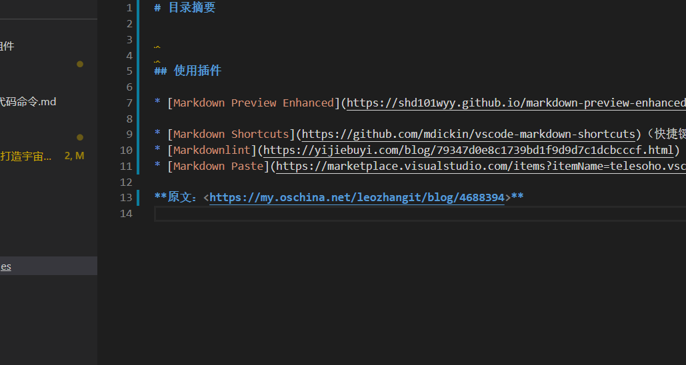

# 目录摘要

## 使用插件

* [Markdown Preview Enhanced](https://shd101wyy.github.io/markdown-preview-enhanced/#/zh-cn/)（多功能插件，渲染为主）

* [Markdown Shortcuts](https://github.com/mdickin/vscode-markdown-shortcuts)（快捷键插件）
* [Markdownlint](https://yijiebuyi.com/blog/79347d0e8c1739bd1f9d9d7c1dcbcccf.html)（语法检测）
* [Markdown Paste](https://marketplace.visualstudio.com/items?itemName=telesoho.vscode-markdown-paste-image) （粘贴图片）

**原文：<https://my.oschina.net/leozhangit/blog/4688394>**

